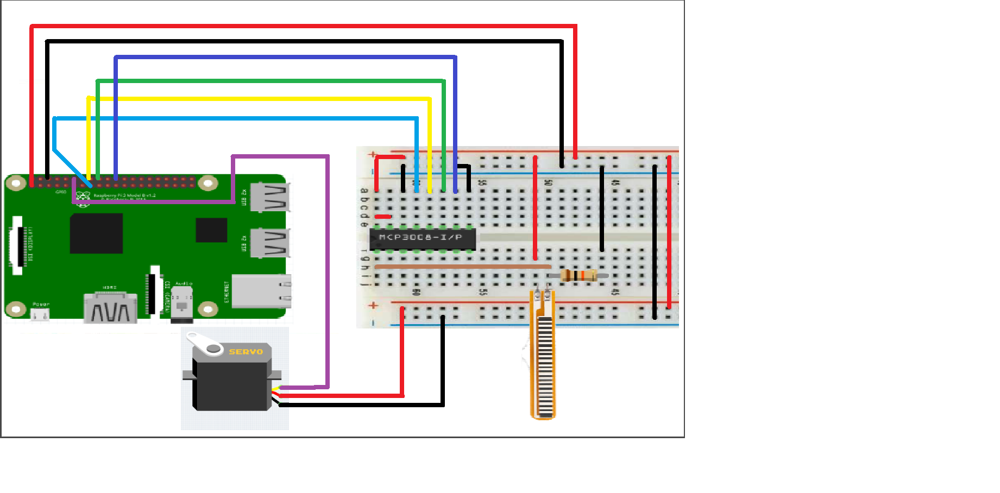

F.I.M.P. Project
================

Project’s website: https://github.com/hennok129/RoboticArm

From: Hennok Tadesse, Alay Lad, and Tanav Sharma

Discipline: Computer Engineering Technology

Date: March 28, 2017

 

\pagebreak

Declaration of Joint Authorship
===============================

The F.I.M.P. robotic arm project consist of three group members (Hennok Tadesse,
Tanav Sharma, and Alay Lad) and is a joint effort on the completion of the
project. The work for the project has been divided equally among the group
members. Alay Lad has worked on the hardware aspect of the project; which
includes working with the flex sensors, creating the PCB’s, and working with the
servo motors for the robotic arm. Hennok Tadesse has worked on the design and
functionality of the mobile application. Tanav Sharma has worked on the database
in terms of setting it up, connecting it with the app and maintaining it.
Testing and maintenance for the hardware and software has been tested by all
three members equally and all project updates and changes have been checked and
approved by all members.

 

\pagebreak

Approved Proposal
=================

September, 2016

*Proposal for the development of FIMP*

Prepared by Tanav, Alay, and Hennok  
*Computer Engineering Technology Student*  
github.com/hennok129/RoboticArm

**Executive Summary**

As a student in the Computer Engineering Technology program, I will be
integrating the knowledge and skills I have learned from our program into this
Internet of Things themed capstone project. This proposal requests the approval
to build the software app that will connect to a hardware as well as to a mobile
device application. In the app, we will have incorporated a controller that will
be used to control the hardware. The database will store the coordinates of the
robot arm and the angles that the motor and arms need to be when it returns to
rest position. The mobile device functionality will include some very basic test
functions and commands to move the arm. It will create logs and save that data,
so the developer can later look it at and make improvements to the hardware or
software and other users can use these logs to reproduce experiments. In the
winter semester I plan to form a group with the following students (Alay Lad,
Hennok Tadesse, and Tanav Sharma), who are also making similar app this term and
working on the mobile application with Tanav Sharma, Alay Lad, and Hennok
Tadesse. The hardware will be completed in CENG 317 Hardware Production
Techniques independently and the application will be completed in CENG 319
Software Project. These will be integrated together in the subsequent term in
CENG 355 Computer Systems Project as a member of a 3 student group.

**Background**

This project will solve many problems. Along with solving problems it will also
be very innovative. It will help gamers with better precision, and interact with
games. Scientists and engineers can use this arm, for experiments where they
need to have certain amount of distance clearance from the test site. The app
will be saving information received from the arm, and provide logs, so the user
can use it to make his/her reports and also use the information to make changes
to better the app or hardware.

I have searched for prior art via Humber’s IEEE subscription selecting “My
Subscribed Content” and have found and read three articles which provides
insight into similar efforts.

The first article is about a continuous-time decentralized neural control scheme
for trajectory tracking of a two degrees of freedom direct drive vertical
robotic arm.[@7762884]

The second article is about the Gesture Controlled Robot (GCR) which is a robot
that can be moved according to our hand movements. [@7583873]

The third article is about the instantaneous current profile tracking control
for minimizing torque ripple of switched reluctance motors.[@6527176]

In the Computer Engineering Technology program we have learned about the
following topics from the respective relevant courses:

-   Java Docs from CENG 212 Programming Techniques In Java,

-   Construction of circuits from CENG 215 Digital And Interfacing Systems,

-   Rapid application development and Gantt charts from CENG 216 Intro to
    Software Engineering,

-   Micro computing from CENG 252 Embedded Systems,

-   SQL from CENG 254 Database With Java,

-   Web access of databases from CENG 256 Internet Scripting; and,

-   Wireless protocols such as 802.11 from TECH152 Telecom Networks.

This knowledge and skill set will enable me to build the subsystems and
integrate them together as my capstone project.

**Methodology**

This proposal is assigned in the first week of class and is due at the beginning
of class in the second week of the winter semester. My coursework will focus on
the first two of the 3 phases of this project:  
Phase 1 Hardware build.  
Phase 2 System integration.  
Phase 3 Demonstration to future employers.

*Phase 1 Hardware build*

The hardware build will be completed in the fall term. It will fit within the
CENG Project maximum dimensions of 12 13/16" x 6" x 2 7/8" (32.5cm x 15.25cm x
7.25cm) which represents the space below the tray in the parts kit. The highest
AC voltage that will be used is 16Vrms from a wall adaptor from which +/- 15V or
as high as 45 VDC can be obtained. Maximum power consumption will be 20 Watts.

*Phase 2 System integration*

The system integration will be completed in the fall term.

*Phase 3 Demonstration to future employers*

This project will showcase the knowledge and skills that I have learned to
potential employers.

The tables below provide rough effort and non-labour estimates respectively for
each phase. A Gantt chart will be added by week 3 to provide more project
schedule details and a more complete budget will be added by week 4. It is
important to start tasks as soon as possible to be able to meet deadlines.

| **Labour Estimates**                                                                      | **Hrs**        | **Notes**                                                                                                                      |
|-------------------------------------------------------------------------------------------|----------------|--------------------------------------------------------------------------------------------------------------------------------|
| **Phase 1**                                                                               |                |                                                                                                                                |
| Writing proposal.                                                                         | 9              | Tech identification quiz.                                                                                                      |
| Creating project schedule. Initial project team meeting.                                  | 9              | Proposal due.                                                                                                                  |
| Creating budget. Status Meeting.                                                          | 9              | Project Schedule due.                                                                                                          |
| Acquiring components and writing progress report.                                         | 9              | Budget due.                                                                                                                    |
| Mechanical assembly and writing progress report. Status Meeting.                          | 9              | Progress Report due (components acquired milestone).                                                                           |
| PCB fabrication.                                                                          | 9              | Progress Report due (Mechanical Assembly milestone).                                                                           |
| Interface wiring, Placard design, Status Meeting.                                         | 9              | PCB Due (power up milestone).                                                                                                  |
| Preparing for demonstration.                                                              | 9              | Placard due.                                                                                                                   |
| Writing progress report and demonstrating project.                                        | 9              | Progress Report due (Demonstrations at Open House Saturday, November 7, 2015 from 10 a.m. - 2 p.m.).                           |
| Editing build video.                                                                      | 9              | Peer grading of demonstrations due.                                                                                            |
| Incorporation of feedback from demonstration and writing progress report. Status Meeting. | 9              | 30 second build video due.                                                                                                     |
| Practice presentations                                                                    | 9              | Progress Report due.                                                                                                           |
| 1st round of Presentations, Collaborators present.                                        | 9              | Presentation PowerPoint file due.                                                                                              |
| 2nd round of Presentations                                                                | 9              | Build instructions up due.                                                                                                     |
| Project videos, Status Meeting.                                                           | 9              | 30 second script due.                                                                                                          |
| **Phase 1 Total**                                                                         | **135**        |                                                                                                                                |
| **Phase 2**                                                                               |                |                                                                                                                                |
| Meet with collaborators                                                                   | 9              | Status Meeting                                                                                                                 |
| Initial integration.                                                                      | 9              | Progress Report                                                                                                                |
| Meet with collaborators                                                                   | 9              | Status Meeting                                                                                                                 |
| Testing.                                                                                  | 9              | Progress Report                                                                                                                |
| Meet with collaborators                                                                   | 9              | Status Meeting                                                                                                                 |
| Meet with collaborators                                                                   | 9              | Status Meeting                                                                                                                 |
| Incorporation of feedback.                                                                | 9              | Progress Report                                                                                                                |
| Meet with collaborators                                                                   | 9              | Status Meeting                                                                                                                 |
| Testing.                                                                                  | 9              | Progress Report                                                                                                                |
| Meet with collaborators                                                                   | 9              | Status Meeting                                                                                                                 |
| Prepare for demonstration.                                                                | 9              | Progress Report                                                                                                                |
| Complete presentation.                                                                    | 9              | Demonstration at Open House Saturday, April 9, 2016 10 a.m. to 2 p.m.                                                          |
| Complete final report. 1st round of Presentations.                                        | 9              | Presentation PowerPoint file due.                                                                                              |
| Write video script. 2nd round of Presentations, delivery of project.                      | 9              | Final written report including final budget and record of expenditures, covering both this semester and the previous semester. |
| Project videos.                                                                           | 9              | Video script due                                                                                                               |
| **Phase 2 Total**                                                                         | **135**        |                                                                                                                                |
| **Phase 3**                                                                               |                |                                                                                                                                |
| Interviews                                                                                | TBD            |                                                                                                                                |
| **Phase 3 Total**                                                                         | **TBD**        |                                                                                                                                |
| **Material Estimates**                                                                    | **Cost**       | **Notes**                                                                                                                      |
| **Phase 1**                                                                               |                |                                                                                                                                |
| Arduino Uno R3                                                                            | \>\$30.95      | (Arduino) Amazon                                                                                                               |
| SparkFun Transceiver Breakout - nRF24L01                                                  | \>\$29.37      | CanadaRobotix                                                                                                                  |
| Syma x12 Nano 6-Axis Gyro 4CH RC Quadcopter Drone                                         | \>\$49.37      | (Tenergy Canada) Amazon                                                                                                        |
| Lithium AA Batteries                                                                      | \>\$5.64       | CanadianTire (1 pack comes with 4 AA batteries)                                                                                |
|                                                                                           |                |                                                                                                                                |
| **Phase 1 Total**                                                                         | **\>\$115.33** |                                                                                                                                |
| **Phase 2**                                                                               |                |                                                                                                                                |
| Materials to improve functionality, fit, and finish of project.                           |                |                                                                                                                                |
| **Phase 2 Total**                                                                         | **TBD**        |                                                                                                                                |
| **Phase 3**                                                                               |                |                                                                                                                                |
| Off campus colocation                                                                     | \<\$100.00     |                                                                                                                                |
| *Shipping*                                                                                | *TBD*          |                                                                                                                                |
| *Tax*                                                                                     | *TBD*          |                                                                                                                                |
| *Duty*                                                                                    | *TBD*          |                                                                                                                                |
| **Phase 3 Total**                                                                         | **TBD**        |                                                                                                                                |

**Concluding remarks**

This proposal presents a plan for providing an IoT solution for creating and
testing solutions for complete physical tasks. This is an opportunity to
integrate the knowledge and skills developed in our program to create a
collaborative IoT capstone project demonstrating my ability to learn how to
support projects. I request approval of this project.

\pagebreak

Abstract
========

The purpose of the fully innovated microprocessor (F.I.M.P.) project is to use
and control robotic arm equipment from a safer environment to lower the risk of
work place injuries. The technical report will go over the way the Fully
Innovated Micro Processor(F.I.M.P.) robotic arm project works and the main
components and features of the project. Components such as the flex sensors,
mobile app, and the robotic arm will all be explained in great detail. The four
flex sensors will be attached to a glove that will control the robotic arm with
pressure from the user’s fingers. The mobile app will also be used to control
the robotic arm but with four sliding bars instead of a sensor. The mobile app
will include features such as allowing the user to record logs. The robotic arm
will consist of acrylic parts and four micro servo motors that move each joint
of the robotic arm. The robotic arm is then connected to a Raspberry Pi 3 that
will be the middle point that will control the robotic arm whether its from the
flex sensors or the mobile app. These three key components are the main focus of
the technical report because it will go over the basic workings of the project
and give users the full understanding of this project.

\pagebreak

Table of Contents
=================

[Declaration of Joint Authorship](#declaration-of-joint-authorship)

[Proposal](#approved-proposal)

[Abstract](#abstract)

[Illustrations or Diagrams](#illustrations-or-diagrams)

1.  [Introduction](#1-introduction)

2.  [Project Specifications](#2-software-requirements-specifications)

    [2.1 Project Description](#21-project-description)

    -   [2.1.1 Mobile Application Concept](#211-product-perspective)

    -   [2.1.2 Project Schedule](#212-system-interfaces)

    -   [2.1.3 Application Screen](#213-user-interfaces)

    -   [2.1.4 Hardware Interfaces](#214-hardware-interfaces)

    -   [2.1.5 Software Interfaces](#215-software-interfaces)

    -   [2.1.6 Communication Interfaces](#216-communication-interfaces)

    [2.2 Build Instructions](#22-build-instructions)

    -   [2.2.1 Introduction](#221-introduction)

    -   [2.2.2 Bill of Materials/Budget](#222-bill-of-materials/budget)

    -   [2.2.3 Time Commitment](#223-time-commitment)

    -   [2.2.4 Mechanical Assembly](#224-mechanical-assembly)

    -   [2.2.5 Power Up](#225-power-up)

    -   [2.2.6 Unit Testing](#226-unit-testing)

    [2.3 Specific Requirements](#23-specific-requirements)

    -   [2.3.1 Database](#231-database)

    -   [2.3.2 Application](#232-web-interface)

    -   [2.3.3 Hardware](#233-hardware)

    [2.4 Progress Reports](#24-progress-reports)

    2.5 Problem Encountered

    -   2.5.1 Hardware Problems

    -   2.5.2 Software Problems

3.  [Conclusion](#3-conclusion)

4.  [Appendix](#4-reference)

5.  [Reference](#5-appendix)

\pagebreak

**Illustrations or Diagrams**
-----------------------------

-   This diagram shows the correct way of connecting the servo motor and the
    flex sensor to the Raspberry Pi 3. Pin 2 is 5 V and pin 5 is ground to power
    the servo motor. When connecting the flex sensor to ground, a 10k ohm
    resistor is needed.

-   This is the MCP3008 Analog to Digital converter which is used to convert the
    analog signal from the flex sensor to a digital signal for the Raspberry Pi
    3 to read. The MCP3008 can take up to 8 analog inputs at once.

\pagebreak

**1. Introduction**
-------------------

We have innovated technology to great measures and even till this day, inventors
and innovators continue to improve our lives with technology. Jobs titles such
as an Aircraft Engineer or a Power Line Technician put their lives at risk, by
working up-close to dangerous moving parts and high amounts of voltage. Due to
these dangers, employees are getting injured at the workplace. With the help of
the Robotic Arm, we aim to prevent these injuries from happening while providing
the same amount of work performance and accuracy. With the help of our glove and
also providing the user to use our arm with the flexibility of our application
feature, the users can now perform their roles from a safer distance.

This project was undertaken due to many reasons; to improve work performance and
safety at workplaces, allow students to use and modify our Robotic Arm and code
for educational purposes, create a fun, entertaining environment for users, and
simply because we are inventors and like to invent. This project was a very fun
and educational experience, we as a team learned a lot about our strengths and
worked together to help each other out through our weaknesses. While working on
this project, we encountered many problems and obstacles; burning out motors
because we applied to much current, we had to re print some acrylic parts for
the Robotic Arm, as some parts broke while assembling the arm, and also, we had
to make some modification to base to fit the weighted base plate. We ran into
problems with connecting the Raspberry Pi 3 to an enterprise wireless network,
but this issue was resolved, by running a simple bash script. Some other
problems we ran into were, connecting to the online database and sending the
motor values simultaneously. This issue was resolved by using threads which
allowed the app to execute the tasks more than once, rather only one time. Not
only did these obstacles expand our knowledge, but it also helped us understand
the importance of time management, communication and asking for help when
needed. We would like to thank Dr. Kristian Medri, as his feedback and advice
was very valuable to the success of our project, and his words definitely would
guide us in the right direction when we came across a dead end. We would also
like to thank Vlad and Prof. Kelly from the prototype lab, for their constant
assistance and advice on our project. It definitely gave us new ideas and helped
us in approaching our project in better, newer ways.

In conclusion, this project was great learning experience for us. We understood
the importance of team work and communication. This project was aimed to provide
a fun, educational, workplace space environment, and we believe we have
successfully achieved that goal.  We aim to keep on innovating and making this
project better as we learn more about motor controls, and sensor sensing. Of
course, we ran into problems, but as team we overcame those hurdles and was a
great learning experience.

\pagebreak

**2. Project Specifications**
-----------------------------

**2.1 Project Description**
---------------------------

### 2.1.1 Mobile Application Concept

The concept of the mobile application is an account based application which can
control the robotic arm much easier than the flex sensor and display the time
and usage of the mobile application. The database was Firebase which would be
changed to the Amazon database due to much more option with other database
provider. The original application had many changes from the planning stage to
now.

During the planning stage, our group had the idea to have a camera on the
robotic arm to view the work being done by the robotic arm in more detail. The
mobile application would be able to view the camera by connect the Raspberry Pi
3 and the mobile device to the same WiFi of the local area. When executing that
concept, we realized there could be a lot of issues with connecting two devices
through WiFi. When testing the connectivity at a personal WiFi (WiFi at home),
their was no issues when connect both the mobile device and the Raspberry Pi 3;
but when testing it on public WiFi (WiFi at Humber), their were connection drops
between the devices.

The original controller for the mobile application, their was two joysticks that
would control all servo motors on the robotic arm. When continuously working
with the application and hardware, we realized that two joysticks would not be
suitable for controlling the robotic arm. One reason for the change was because
it was difficult to control (it was just as difficult to control as the flex
sensors). When completing the mobile application, we realized that we needed to
change the robotic arm controller to make a much more user friendly experience.

### 2.1.2 Project Schedule

**Phase 1**

·         Creating Project Proposal

Wednesday (9/7/16) – Thursday (9/8/16)

·         Creating Budget

Wednesday (9/14/16) – Thursday (9/15/16)

·         Acquiring components, Progress Report

Wednesday (9/21/16) – Thursday (9/22/16)

·         Mechanical Assembly, Second Progress Report

Wednesday (9/28/16) – Thursday (9/29/16)

·         PCB Fabrication

Wednesday (10/5/16) – Thursday (10/6/16)

·         Interface wiring, Placard design

Wednesday (10/12/16) – Thursday (10/13/16)

·         Preparing demonstration

Wednesday (10/19/16) – Thursday (10/20/16)

·         Writing progress report/demo project

Wednesday (10/26/16) – Thursday (10/27/16)

·         Edit build video

Wednesday (11/2/16) – Thursday (11/3/16)

·         Writing progress report/status meeting

Wednesday (11/9/16) – (11/10/16)

·         Practice presentations

Wednesday (11/16/16) – Thursday (11/17/16)

·         Conduct Presentations

Wednesday (11/23/16) – Thursday (11/24/16)

·         Build instructions

Wednesday (11/30/16) – Thursday (12/1/16)

·         Project videos, Status meeting

Wednesday (12/7/16) – Thursday (12/8/16)

 

**Phase 2**

·         Group meeting

Monday (1/9/17) – Tuesday (1/10/17)

·         Initial integration

Monday (1/16/17) – Tuesday (1/17/17)

·         Software Requirement Specifications(SRS)

Monday (1/23/17) – Tuesday (1/24/17)

·         Progress report

Monday (1/30/17) – Tuesday (1/31/17)

·         Project status

Monday (2/6/17) – Tuesday (2/7/17)

·         Progress report of independent progress

Monday (2/13/17) – Tuesday (2/14/17)

·         Project status

Monday (2/20/17) – Tuesday (2/21/17)

·         Progress report/project integration

Monday (2/27/17) – Tuesday (2/28/17)

·         Testing

Monday (3/6/17) – Tuesday (3/7/17)

·         Project status

Monday (3/13/17) – Tuesday (3/14/17)

·         Prepare for demonstration

Monday (3/20/17) – Tuesday (3/21/17)

·         Complete presentation

Monday (3/27/17) – Tuesday (3/28/17)

·         Complete final report

Monday (4/3/17) – Tuesday (4/4/17)

·         Write video script

Monday (4/10/17) – Tuesday (4/11/17)

·         Project videos

Monday (4/17/17) – Tuesday (4/18/17)

 

### 2.1.3 Application Screens

### Login Screen:

The login screen will present users with two edit text fields asking the user to
enter a username and password. If the user doesn’t have an account, their is an
option that will allow users to create an account and store it into a database.
If a user enters an incorrect username and/or password, the mobile application
will present an error message on the screen.

 

### Register Screen:

The register screen will display four edit text fields with the four fields
being the users full name, the username, the password, and the confirmation for
the passwords. Once the user finishes entering the four edit text fields, all
the fields will be sent to a online database and will allow the user to login
into the application. The password the user enters must be more than five
characters long and the password and confirmation password must be the same. If
there is an issue with registration process, their will be an error message on
the screen and the entered fields will not be stored into the database.

 

### Menu Screen:

The menu screen will display the title of the project (F.I.M.P. Project) and two
options for the user to chose from. One option is the controller screen which
will allow the user to control the robotic arm using Bluetooth from the phone to
the Raspberry Pi. The other option is user logs screen that display all the
users that used the application to control the robotic arm. There is also a task
bar on the top of the screen that have to option to logout of the application
and will require the user to login again to use the application again.

 

### Controller Screen:

The controller screen is the main functionality of the mobile application that
allows users to control the robotic arm through Bluetooth. The controller screen
contains four sliding bars (seek bars) that will control the arm depending on
the position of the sliding bar. Along with the sliding bars, it also contains a
reset button to reset the position of the arm to its centered position and
displaying the sliding bar values on the screen.

###  

### User Log Screen:

The user log screen contains all the time that users have entered the controller
screen to control the robotic arm with the time, day, and username. Once a user
enters the controller screen, the mobile application will store the time and day
the user entered the controller screen; along with the username of the user. The
user logs will be displayed in a list in an organized way and will be able to
track who and when a user is using the robotic arm and have it be saved all onto
a database.

 

### 2.1.4 Hardware Interfaces

 

### 2.1.5 Software Interfaces

 

### 2.1.6 Communication Interfaces

\pagebreak

**2.2 Build Instructions**
--------------------------

### Introduction

This project will solve many problems. Along with solving problems it will also
be very innovative. It will help gamers with better precision, and interact with
games. With the haptic feedback feature it will create a real life experience
for the user and allow them to make better decisions. Scientists and engineers
can use this arm, for experiments where they need to have certain amount of
distance clearance from the test site. It can also withstand great amounts of
temperature that the normal human hand or body wont be able to bear. Scientists
can deal with hot object like lava rocks, or other hot surfaces. These arms can
also be used in space, where the astronauts can use the arm from their space
ship. With the help of the app, and the integrated camera it will allow users to
interact with the environments outside of their reach, and capabilities. Also
the app will be saving information received from the arm, and provide logs, so
the user can use it to make his/her reports and also use the information to make
changes to better the app or hardware.

 

### Budget

The budget was planned to be under 200\$ Canadian dollars, unfortunately I
surpassed that limit and had to get a new Raspberry Pi and few other items so my
budget has increased slightly.

 

1.  [New Raspberry Pi 3 kit - \$99
    CAD](https://www.amazon.ca/gp/product/B01CCF6V3A/ref=oh_aui_detailpage_o02_s00?ie=UTF8&psc=1)

-   Includes Raspberry Pi 3 (RPi3) Model B Quad-Core 1.2 GHz 1 GB RAM

-   On-board WiFi and Bluetooth Connectivity

-   32 GB Micro SD Card (Class 10) - Raspberry Pi Recommended Micro SD Card
    pre-loaded with NOOBS

-   CanaKit 2.5A USB Power Supply with Micro USB Cable and Noise Filter -
    Specially designed for the Raspberry Pi 3 (UL Listed)

-   High Quality Raspberry Pi 3 Case, Premium Quality HDMI Cable, 2 x Heat
    Sinks, GPIO Quick Reference Card, CanaKit Full Color Quick-Start Guid

 

1.  [Robot arm Kit - \$70CAD](https://shop.mime.co.uk/)

-   FEATURES

    4 hobby servos giving 3 DOF and gripper.

    Easy to assemble.

    Laser cut parts.

    20cm reach.

-   INCLUDED

    4x Hobby Servos.

    1x Set of laser cut acrylic parts.

    1x Servo extension cable.

    4x Rubber feet.

     

1.  [Flex Sensor (4.5") - \$18.49 CAD X
    4](http://www.canadarobotix.com/force-sensors/flex-sensor-4-5-fs7548)

The Flex Sensor patented technology is based on restrictive carbon elements. As
a variable printed resistor, the Flex Sensor achieves great form-factor on a
thin flexible substrate. When the substrate is bent, the sensor produces a
resistance output correlated to the bend radius—the smaller the radius, the
higher the resistance value.

 

Spectra Symbol has used this technology in supplying Flex Sensors for the
Nintendo Power Glove, the P5 gaming glove, and the below:

-   Applications

-   Automotive controls

-   Medical devices

-   Industrial controls

-   Computer peripherals

-   Fitness products

-   Musical instruments

-   Measuring devices

-   Virtual reality games

-   Consumer products

-   Physical therapy

Spectra Symbol Designers can vary the actual nominal resistance of the Flex
Sensors to meet customer’s needs. We can produce our Flex Sensors on a variety
of substrates, for example, we can use Dupont’s Kapton material if you require
high temperature operations.

 

1.  [Adafruit 16-Channel PWM
    \$34](https://www.amazon.ca/gp/product/B00SI1SPHS/ref=oh_aui_detailpage_o01_s00?ie=UTF8&psc=1)

You want to make a cool Arduino robot, maybe a hexapod walker, or maybe just a
piece of art with a lot of moving parts. Or maybe you want to drive a lot of
LEDs with precise PWM output. Then you realize that the Arduino has only a few
PWM outputs, and maybe those outputs are conflicting with another shield! What
now? You could give up OR you could just get our handy PWM and Servo driver
shield. It's just like our popular PWM/Servo Breakout but now Arduino-ready and
works with any Arduino that uses shields: Uno, Leo, Mega, ADK, it’s all good.

-   There's an I2C-controlled PWM driver with a built in clock. That means that,
    unlike the TLC5940 family, you do not need to continuously send it signal
    tying up your microcontroller, its completely free running!

-   It is 5V compliant, which means you can control it from a 3.3V Arduino and
    still safely drive up to 6V outputs (this is good for when you want to
    control white or blue LEDs with 3.4+ forward voltages)

-   6 address select pins so you can stack up to 62 of these on a single i2c
    bus, a total of 992 outputs - that's a lot of servos or LEDs

-   Adjustable frequency PWM up to about 1.6 KHz

-   12-bit resolution for each output - for servos, that means about 4us
    resolution at 60Hz update rate

-   Configurable push-pull or open-drain output

We wrapped up this lovely chip into a shield with a couple nice extras

-   Terminal block for power input (or you can use the 0.1" breakouts on the
    side)

-   Reverse polarity protection on the terminal block input

-   Green and red power-good LEDs

-   3 pin connectors in groups of 4 so you can plug in 16 servos at once (Servo
    plugs are *slightly* wider than 0.1" so you can only stack 4 next to each
    other on 0.1" header

-   Stackable design. You'll need to pick up stacking headers and right angle
    3x4 headers in order to stack on top of this shield without the servo
    connections getting in the way.

-   A spot to place a big capacitor on the V+ line (in case you need it)

-   220 ohm series resistors on all the output lines to protect them, and to
    make driving LEDs trivial

-   Solder jumpers for the 6 address select pins

-   A lot of extra space remaining? Let's turn it into a prototyping area. You
    get a 5x20 proto area for any extra wiring you'd like to add

 

### Time Commitment

-   Buying All the Parts - 1-2 Weeks

its took one week to find out what  hardware we need it for this project and
soon as we had list for this hardware we order online

some of the parts came on time for example Raspberry pi kit, and Flex Sensor on
other hand Robot arm Kit took more than 2 week to arrive and Adafruit 16-Channel
PWM almost took around 3 to 4 week to arrive.

 

-   Building Robot - 4 hours

For building robot wasn’t an easy job because when we was building it we broke
some parts of the robots and we have to replace it and for those parts took some
time to get it back from prototype lab.

 

-   Building PCB - 3 hours

Building PCB was took way more than 3 hours because we made almost 3 PCB.

First one was a really small so we had trouble with soldering it.

Second one was good one but we had trouble placing it on top of the raspberry
pi.

And the final one took more time because we had to find out how to use all the
raspberry pi hat library and edit, and on top of that we even use two layer PCB.

 

-   Programming - 1 week

We didn’t finished the programming on time because 1st we try to program it
without Adafruit 16-Channel PWM and that one took around 1 week to do it and
soon as we finished that we start programming with the Adafruit 16-Channel PWM
library so we can use the same program that we made it without Adafruit
16-Channel PWM.  And its took around another week to do it.

After we finished the programming just a robot we add a Flex sensor in it and
for the sensor we need to use MCP3008 \| Raspberry Pi Analog to Digital
Converters and its took around one more week to program a flex sensor.

 

### Mechanical Assembly

**STEP 1**

The MeArm should be fun to build and easy to control. We’ve spent a lot of time
putting together instructions for building and controlling the MeArm. We advise
that you work out and test how to control your Servo Motors before constructing
your MeArm. It will save you time and frustration, and lessen the chance that
your MeArm will just be something cool to sit on your shelf.

>   [1 Servos](https://ladzone.github.io/blog/servo.py)

>   [2 Servos](https://ladzone.github.io/blog/servo1.py)

>   [All Four Motors controlling with
>   keyboard](https://ladzone.github.io/blog/Test1.py)

 

**STEP 2**

Using the instruction from the MeArm robotic arm instruction, we followed the
steps to assembling the robotic arm.

 

**STEP 3**

*Using A Flex sensor and Servo On The Raspberry Pi Using An MCP3008*

 

The MCP3008 is a low cost 8-channel 10-bit analog to digital converter.  The
precision of this ADC is similar to that of an Arduino Uno, and with 8 channels
you can read quite a few analog signals from the Pi.  This chip is a great
option if you just need to read simple analog signals, like from a temperature
or light sensor.  If you need more precision or features, check out the ADS1x115
series on the next page.

Before you use the MCP3008 it will help to skim this older Raspberry Pi MCP3008
guide for more information about using it with the Raspberry Pi.  However don't
use the code from the older guide as it's deprecated.  This guide will show you
an easier way to install and use new Python code to talk to the MCP3008 ADC.

 

Pins for MCP3008:

$$
VDD 3.3V
$$

$$
VREF 3.3V
$$

$$
AGND GROUND
$$

$$
CLK GPIO11 (P1-23)
$$

$$
DOUT GPIO9 (P1-21)
$$

$$
DIN GPIO10 (P1-19)
$$

$$
CS GPIO8 (P1-24)
$$

$$
DGND GROUND
$$

 

*Breadboard Circuit*

Here is the test circuit:

The MCP3008 is wired up just as it was in my previous post :

>   MCP3008           Pi                

>   \-------------- ----------------

>   Pin 1 (CH0) -

>   Pin 2 (CH1) -

>   Pin 3 (CH2) -

>   Pin 9 (DGND) Pin 6 (Ground)

>   Pin 10 (CS) Pin 24 (GPIO8)

>   Pin 11 (DIN) Pin 19 (GPIO10)

>   Pin 12 (DOUT) Pin 21 (GPIO9)

>   Pin 13 (CLK) Pin 23 (GPIO11)

>   Pin 14 (AGND) Pin 6 (Ground)

>   Pin 15 (VREF) Pin 1 (3.3V)

>   Pin 16 (VDD) Pin 1 (3.3V)

 

**Python Test Script**

>   \#!/usr/bin/env python

>   import time

>   import RPi.GPIO as GPIO

>   GPIO.setmode(GPIO.BCM)

>   GPIO.setwarnings(False)

>   \# read SPI data from MCP3008 chip, 8 possible adc's (0 thru 7)

>   def readadc(adcnum, clockpin, mosipin, misopin, cspin):

>   if ((adcnum \> 7) or (adcnum \< 0)):

>   return -1

>   GPIO.output(cspin, True)

>   GPIO.output(clockpin, False) \# start clock low

>   GPIO.output(cspin, False) \# bring CS low

>   commandout = adcnum

>   commandout \|= 0x18 \# start bit + single-ended bit

>   commandout \<\<= 3 \# we only need to send 5 bits here

>   for i in range(5):

>   if (commandout & 0x80):

>   GPIO.output(mosipin, True)

>   else:

>   GPIO.output(mosipin, False)

>   commandout \<\<= 1

>   GPIO.output(clockpin, True)

>   GPIO.output(clockpin, False)

>   adcout = 0

>   \# read in one empty bit, one null bit and 10 ADC bits

>   for i in range(12):

>   GPIO.output(clockpin, True)

>   GPIO.output(clockpin, False)

>   adcout \<\<= 1

>   if (GPIO.input(misopin)):

>   adcout \|= 0x1

>   GPIO.output(cspin, True)

>   adcout \>\>= 1 \# first bit is 'null' so drop it

>   return adcout

>   PWMOUT = 18

>   SPICLK = 22

>   SPIMISO = 23

>   SPIMOSI = 24

>   SPICS = 25

>   \# set up the interface pins

>   GPIO.setup(PWMOUT, GPIO.OUT)

>   GPIO.setup(SPIMOSI, GPIO.OUT)

>   GPIO.setup(SPIMISO, GPIO.IN)

>   GPIO.setup(SPICLK, GPIO.OUT)

>   GPIO.setup(SPICS, GPIO.OUT)

>   \# 10k trim pot connected to adc \#0

>   potentiometer\_adc =0; pwm\_freq = 50 \# Set the PWM frequency to 50 Hz

>   last\_read = 0 \# this keeps track of the last potentiometer value

>   tolerance = 0 \# to keep from being jittery we'll only change

>   \# volume when the pot has moved more than 5 'counts'

>   \# Configure the PWM pin

>   p = GPIO.PWM(PWMOUT, pwm\_freq) \# channel=18 frequency=50Hz

>   p.start(9)

>   try:

>   while True:

>   \# we'll assume that the pot didn't move

>   trim\_pot\_changed = False

>   \# read the analog pin

>   trim\_pot = readadc(potentiometer\_adc, SPICLK, SPIMOSI, SPIMISO, SPICS)

>   \# how much has it changed since the last read?

>   pot\_adjust = abs(trim\_pot - last\_read)

>   if ( pot\_adjust \> tolerance ):

>   trim\_pot\_changed = True

>   last\_read = trim\_pot

>   if ( trim\_pot\_changed ):

>   pwm\_pct = round((trim\_pot) / 2) \# Determine current voltage percentage

>   pwm\_pct = int(pwm\_pct) \# Cast the value as an integer

>   DC= 1./18\*(pwm\_pct)

>   print "ADC read: ", trim\_pot

>   print "PWM percentage: ", pwm\_pct

>   print "PWM Duty Cycle: ", DC

>   p.ChangeDutyCycle(DC)

>   \# hang out and do nothing for a half second

>   time.sleep(0.5)

>   except KeyboardInterrupt:

>   pass

>   p.stop()

>   GPIO.cleanup()

 

**STEP 4**

Making PCB for Flex Sensor:

This is the schematic for the PCB that will contant the MCP3008 chip and the
flex sensors to be connected.

This is the board which was created using the Eagle program.

 

**STEP 5**

Adding Adafruit\_PWM\_Servo\_Driver to Raspberry Pi 3:

 

### Testing

**This can then be run using :**

sudo python (File name) .py

If everything has worked correctly you should see an output that looks something
like :

**Test 1**

\pagebreak

**2.3 Project Breakdown**
-------------------------

### 2.3.1 Database

For the database, we will be using a Rational Database on an Amazon Web Server;
this service is provided by Amazon. On this server, I have created multiple PHP
files, that are responsible for establishing the connection with the database,
registering the user, logging in the user, and one for creating the user logs.
These files are in charge of the backend process and functionality of the
database. This database is responsible for holding two tables; user accounts and
user logs.

User Account

1.	This table holds the information of the users who registers.

2.	This table is accessed when the user either registers or logs in.

3.	It holds a User ID which is auto incremented every time a user registers,
first name of the user, last name of the user, the username and their password.

 

When the user registers and the credentials already exist on the server, the
server will return an error, notifying the user that the user already exists”.
If the user tries to login with the wrong credentials and it does not match the
information on the server, it will notify the use that they have entered the
wrong credentials.

User Logs

1.	This table is generated when the user launches the controller function on the
application.

2.	It creates a table, that holds the start and end values of each motor, and the
User ID of the user logged in. The data in this table is linked with the users
in the first table with User ID’s. User may create as many logs within a day.

The purpose of the database is to mainly allow the user to create a personal
account, and to allow them to store all their logs while using the arm. Creating
a table and linking it to their Unique ID allows the user to know, which logs
are being accessed when they want to review their tests. These logs can only be
used for research and development reasons only, which will be stated in the
Terms and Condition document provided with the product and also displayed to the
user when launching the application.

 

Below is the code for my PHP files:

“Init.php”

\<?php

	\$db\_name = "/provide you database name";

	\$mysql\_user = "/provide your database username";

	\$mysql\_pass = "/provide your database password";

	\$server\_name= "/provide your database link";

 

	\$con = mysqli\_connect(\$server\_name,\$mysql\_user,\$mysql\_pass,\$db\_name);

 

	if(!\$con){

		//echo "Connection Error..".mysqli\_connect\_error();

	}else{

		//echo "\<H3\>Success\</H3\>";

	}

?\>

 

“register.php”

\<?php

	

	//calling the file, to initate the connection

	require "init.php";

	

	\$fname = \$\_POST["fname"];

	\$lname = \$\_POST["lname"];

	\$user\_name = \$\_POST["username"];

	\$user\_pass = \$\_POST["password"];

	

 

	\$sql\_query = "INSERT INTO users (fname, lname, username, password) values
('\$fname','\$lname','\$user\_name','\$user\_pass');";

	

	if(mysqli\_query(\$con,\$sql\_query)){

		//echo "values inserted";

	}else{

		//echo "error inserting values";

	}

 

?\>

 

“Createlogs.php”

\<?php

	

	//calling the file, to initate the connection

	require "init.php";

	

	

	\$clawStart = \$\_POST["clawStart"];

	\$clawStop = \$\_POST["clawStop"];

 

	\$baseStart = \$\_POST["baseStart"];

	\$baseStop = \$\_POST["baseStop"];

 

	\$elbowStart = \$\_POST["elbowStart"];

	\$elbowStop = \$\_POST["elbowStop"];

 

 

	\$shoulderStart = \$\_POST["shoulderStart"];

	\$shoulderStop = \$\_POST["shoulderStop"];

 

 

	\$sql\_log\_query = "INSERT into
logs(clawStart,clawStop,baseStart,baseStop,elbowStart,elbowStop,shoulderStart,shoulderStop)values(\$clawStart,\$clawStop,\$baseStart,\$baseStop,\$elbowStart,\$elbowStop,\$shoulderStart,\$shoulderStop)";

 

	if(mysqli\_query(\$con,\$sql\_log\_query)){

		//echo "data write success";

	}else{

		echo "\$sql\_log\_query";

		//echo "data write un-success";

	}

?\>

 

(Developed By Tanav Sharma)

 

### 2.3.2 Application

The overall concept of the mobile application for the project is to control the
four servo motors of the robotic arm and keep logs on the user’s actions. The
first screen of the application will be the login screen which will require an
email and password to create and login to an account. The accounts are used to
hold individual logs of the user’s controller usage. When logged in, the user is
presented with two option; controller and user logs.

The first option of the application is to control the motor with four sliders
that will control the arms movements. When the application first begins, the
sliders will be set to a default (centered) position. When exiting the
application, the robotic arm will return to its default position after all
created movements.

During the controller screen, the application will have logs of the user’s usage
and will be presented in the user log screen. The user logs will contain the log
of all the users usage of the application based on the users in the database. In
conclusion, the login screen, controller screen, and user logs are the three key
features of the application. The key developer of this application will be
Hennok Tadesse with some help from Tanav Sharma.

(Developed by Hennok Tadesse)

 

### 2.3.3 Hardware

**ROBOTIC ARM**

FIMP project aims to bring a simple Robot Arm well within the reach and budget
of the average educator, student, parent or child. The design brief we set out
with was to build a full robot arm kit with standard low cost screws, low cost
servo motors and using less than 300 x 200mm (\~A4) of acrylic

**MCP3008**

In order to measure the X and Y voltages I decided to use an MCP3008 10 bit
Analogue to Digital Converter. These devices are cheap, easy to setup and allow
8 analogue inputs to be read by the Pi using its SPI interface.

**Adafruit 16-Channel PWM**

The Raspberry Pi is a wonderful little computer, but one thing it isn't very
good at is controlling DC Servo Motors - these motors need very specific and
repetitive timing pulses to set the position. Instead of asking the Pi Linux
kernel to send these signals, pop on this handy HAT! It adds the capability to
control 16 Servos with perfect timing. It can also do PWM up to 1.6 KHz with 12
bit precision, all completely free-running.

**Flex Sensor 4.5**

A simple flex sensor 4.5" in length. As the sensor is flexed, the resistance
across the sensor increases. Patented technology by Spectra Symbol - they claim
these sensors were used in the original Nintendo Power Glove.

The resistance of the flex sensor changes when the metal pads are on the outside
of the bend.

(Developed by Alay Lad)

\pagebreak

**2.4 Progress Reports**
------------------------

### Progress report sent on January 31, 2017:

Dear Kristian Medri,

The current progress for the F.I.M.P. (robotic arm) project has been following
the schedule shown in the proposal and gannet chart. The overall budget has
stated the same other than buying a 650 μf and a golf glove that Alay had
already owned.

For the hardware, we have made progress on moving the all servo motors on the
robotic arm with a flex sensor and was able to solder one of the flex sensor to
a custom made PCB created by Alay. This will allow us to put the flex sensors
into a glove. For testing this flex sensor, we are using a golf glove with the
sensor on one finger to move on of the motors. We are current working on
creating a smaller PCB that will placed on top of the raspberry pi on the Eagle
application. Along with the PCB, are also creating a case for the raspberry pi
that will fit the raspberry pi, DAC custom made PCB, and Adafruit 16-Channel
PWM.

For the android phone application, we are keeping the app we created from last
semester but are changing the overall design of the controller. The design of
the controller is going to be 4 sliders that will control all the servo motors
for the robotic arm. We created the designs for the app and are ready to
implement the designs on android studio.

For the database, we are still undecided on which database to use. Firebase was
the originally the database we used for the android app but we are not sure if
it will be suitable for this semester. Tanav suggested that our group use Google
Cloud for the projects database. Once we have decided on the current database we
can start creating tables and integrating it to the android app.

In conclusion, we are on track to completing the project on its required time
and will continue to update the github website with test code, design documents,
and other project information. The link to the github
is <https://github.com/hennok129/RoboticArm>.

 

Sincerely,

Hennok Tadesse

###  

### Independent progress report sent on February 16, 2017:

Dear Kristian Medri,

My current progress for the F.I.M.P project has been on track with the schedule
shown in the proposal and Gant chart. The overall budget has stayed the same
with no changes from the last progress report. My main contribution with the
project has been the back-end development of the application and assisting
Hennok with the overall design of the app.

I originally decided to use Firebase Database as our online database platform. I
ran into many problems as Firebase does not grant its user full access to its
back-end system and is restricted in terms of usability and flexibility. The
database that we have now decided to go for, is the Amazon Web Service
RDS(Rational Database). This way I will have full access to the back-end, and it
gives us more flexibility as I can create my own SQL statements to suit my needs
and the application.

The application that will be used to control the hardware, needs a lot of
redesigning. I have designed and will be implementing a login, register screen
and a log recorder feature. The log recorder feature will be able to store the
logs of the run, into a table. These tables can later be used for analysis,
report making, and/or re-running the tests. To make a more user friendly
interface, I have also designed and implemented a navigation drawer. This will
allow the user to access the different features offered by the app, that will be
getting updated regularly.

Overall my contribution to the group has been well, and works towards a
successful completion of the project. Me and my team will continue to update the
github website with test code, design documents, and other project information.
The link to the github is <https://github.com/hennok129/RoboticArm>.

 

Sincerely,

Tanav Sharma

 

### Continuation of the independent progress report sent on February 19, 2017:

Dear Kristian Medri,

This progress report is an continuation to the original independent progress
report sent to you by Tanav on February 19, 2017. The continuation will discuss
the independent progress that Alay and I have done. 

My contribution to the project is to design and create the mobile application
that controls the robotic arm. I have created and completed the design of the
controller for the robotic arm which uses four sliding bars (seek bars) that
will control the arm depending on the position of the sliding bar. Along with
the sliding bars, I have included a reset button to reset the position of the
arm to its centered position and displaying the sliding bar values on the
screen. The work that needs to be done for the software portion is to figure out
a way to control the arm with mobile application and will be working with Alay
on moving it with Bluetooth or WIFI.

Alay’s contribution to the project is to assemble and work with the hardware for
the project by creating a PCB for the flex sensors and designing the glove to
move the robotic arm. Alay has created a new PCB that is connected to the flex
sensors. Alay had trouble with the PCB he created last week due to a capacitor
on the Raspberry Pi being in the way. Alay had also created a base plate for the
robotic arm to avoid the arm from falling over. The progress that needs to be
done for the hardware is to solder the flex sensors to the PCB and create the
glove for the flex sensors.

In conclusion, we are reaching the completion of our hardware portion of the
project and are working on the communication between the mobile application and
the robotic arm. Test code, design documents, and other project information will
be available at this github:

<https://github.com/hennok129/RoboticArm>.

 

Sincerely,

Hennok Tadesse

###  

### Integration progress report sent on March 7, 2017:

Dear Dr. Kristian Medri,

This progress report will discuss the project collaboration that I, Hennok, and
Tanav have done. The integration is between the MeArm robotic arm, mobile
application, and the online database.  

My contribution to the project is to assemble and work with the hardware for the
project by creating PCBs for the flex sensors. I am still working on designing
the glove to move the robotic arm. The flex sensor PCBs has been completed.  I
am also creating a base plate for the robotic arm for weight and balance to
prevent the arm from falling over during use. The base plate approximate cost is
around \$20. On that note, we have bought ribbon cable, which has cost \$3, and
the Bluetooth adapter, which has cost \$15. There is currently no integration
between the mobile application and hardware yet, but we are figuring out a way
to control the arm with the mobile application using Bluetooth.

Hennok’s contribution to the project is to design the mobile application that
controls the robotic arm. He also created and completed the design of the
controller for the robotic arm which uses four sliding bars (seek bars) that
will control the arm depending on the position of the sliding bar. Along with
the sliding bars, I have included a reset button to reset the position of the
arm to its centered position and which displays the sliding bar values on the
screen. Hennok worked with Tanav to integrate the online database that Tanav had
made to add a login and register screen, and user logs.

Tanav’s contribution to the project is to create a database and connect it with
the mobile application. He has completed making the database using Amazon Web
Service RDS (Rational Database) and he was also able to connect to the database
with the mobile application. Currently, he is going to work with me on
connecting the robotic arm using Bluetooth to the mobile application and the
Raspberry Pi.

In conclusion, we are close to completion of our hardware portion of the project
and we are working on the integration between the mobile application and the
robotic arm. The test code, design documents, and other project information will
be available at this GitHub:<https://github.com/hennok129/RoboticArm>.

 

Sincerely,

Alay Lad

 

### Troubleshooting status report sent on March 21, 2017:

Dear Kristian Medri,

This progress report will go over the status of troubleshooting the overall
project and issues we have come across since the last progress report. The
budget has not changed from the last progress report and we are currently on
schedule to completing the project on time.

We were having a lot of our problems with moving the robotic arm with the flex
sensors; once Alay had finished creating the PCB for the sensors. The issue we
had was that the program on the Raspberry Pi 3 was able to get the value on the
sensor but the robotic arm was not able to read the values; therefore, we were
having issues moving the robotic arm. We fixed this issue by checking if all the
components on the PCB was working, and found out that the MCP3008 (Analogue to
Digital Converter) was not being powered. Once we powered the integrated
circuit, the robotic arm was working with all motors moving based on the flex
sensors values.

We also had some issues with the mobile application and database with sending
data to the database more than one time. The issue was sending the start and end
points of the controller to the database to see if it could control the servos
on the robotic arm. Tanav has come up with a solution to this problem by using
JAVA threads with the mobile application to send data more than once to the
database.

Overall, the main focus for the project, at the moment, is to get the mobile
application and robotic arm to communicate with each other and to complete the
technical report. The link to the github
is <https://github.com/hennok129/RoboticArm>.

 

Sincerely,

Hennok Tadesse

\pagebreak

**2.5 Problems Encountered**
----------------------------

### Hardware Problems:

During the creation of the robotic arm, our group tested the micro servo motors
to see how the servo motors move and the limits of the motors. When powering one
of the servo motor, our group had put too much Amps (current) to the motor which
caused the servo motor to burn out. This was an issue that all the group members
have had which caused each group member to burn one or more servo motors. The
solution to this problem was to always note how many Amps are being put into the
servo motors (A safe amount of Voltage and Amps to put into all four servo
motors is 5 V and 2 A).

When using the flex sensors to control the robotic arm, their were some issues
with reading values consistently. At times, it felt as if the robotic arm would
read values one time then not read values another time. The problem was with the
PCB that was created to connect the flex sensors to the MCP3008 (Analogue to
Digital Converter) IC. When soldering the PCB, we were not very careful with
making sure every component was soldered well and the IC was not being powered
leading to the readings of the flex sensor to be incorrect. The solution was to
make sure the IC was soldered correctly and was powering up correctly.

 

### Software Problems:

During the ingratiation of the mobile application and database, their were some
issues with sending data to the database multiple times. The issue was noticed
when trying to make two user accounts on the mobile application and when making
one account, the mobile application will create and store the information into a
database; But when making another account, the application will crash and must
re-launch the application to create the second account. To correct this issue,
our group had made JAVA threads to send multiple data to the database. This
fixed issues with creating multiple users and recording the user logs to store
data multiple times.

Another mobile application issue our team had come across was the connection
between the mobile application and the robotic arm. Our original plan was to
connect the Raspberry Pi 3 to the online database and to have the mobile
application send start and end points of the seek bars position and move the
robotic arm depending on the position. As the project came along, we realized
that it would be very difficult to do so and would cause a lot of unneeded data
on the database. Our solution to the issue was to control the arm using the
Bluetooth on the Raspberry Pi 3 and the mobile device’s Bluetooth.

 

**3. Conclusion**
-----------------

This project was aimed to create a safer work environment for engineers and
technicians, and to create a fun educational experience for the general public.
We wanted to reduce the rate of work place injuries, and could not have thought
of a better way. This F.I.M.P Arm has one main function, to give the user the
ability to perform their job/task with ease and safely. The arm consists of four
motors, which is connected to the 4 flex sensors in the glove. As the user
flex’s their fingers, it sends the values from the sensor to the motors to mimic
the motion. The arm can also be controlled via Android application, which
connects to the arm via Bluetooth. The application controls the values with four
sliding bars, the application allows the user to start a log and send the values
of the motor to the database, which can be later viewed for report/diagnostic
purposes. The final version of our project meets all the requirements that are
needed to complete/rebuild this project.  
 \pagebreak

**4. Appendix**
---------------

### Python code for running four motors with all four flex sensors:

`#!/usr/bin/env python`

 

`import time`

`import RPi.GPIO as GPIO`

`from Adafruit_PWM_Servo_Driver import PWM`

 

`# Initialise the PWM device using the default address`

`pwm = PWM(0x40)`

`# Note if you'd like more debug output you can instead run:`

`#pwm = PWM(0x40, debug=True)`

 

`GPIO.setmode(GPIO.BCM)`

`GPIO.setwarnings(False)`

 

`# read SPI data from MCP3008 chip, 8 possible adc's (0 thru 7)`

`def readadc(adcnum, clockpin, mosipin, misopin, cspin):`

`if ((adcnum > 7) or (adcnum < 0)):`

`return -1`

`GPIO.output(cspin, True)`

 

`GPIO.output(clockpin, False)  # start clock low`

`GPIO.output(cspin, False)     # bring CS low`

 

`commandout = adcnum`

`commandout |= 0x18  # start bit + single-ended bit`

`commandout <<= 3    # we only need to send 5 bits here`

`for i in range(5):`

`if (commandout & 0x80):`

`GPIO.output(mosipin, True)`

`else:`

`GPIO.output(mosipin, False)`

`commandout <<= 1`

`GPIO.output(clockpin, True)`

`GPIO.output(clockpin, False)`

 

`adcout = 0`

`# read in one empty bit, one null bit and 10 ADC bits`

`for i in range(12):`

`GPIO.output(clockpin, True)`

`GPIO.output(clockpin, False)`

`adcout <<= 1`

`if (GPIO.input(misopin)):`

`adcout |= 0x1`

 

`GPIO.output(cspin, True)`

 

`adcout >>= 1       # first bit is 'null' so drop it`

`return adcout`

 

 

 

 

`PWMOUT = 0`

`PWMOUT2 = 1 #left M`

`PWMOUT3 = 2 #left/right`

`PWMOUT4 = 3  #right M`

 

`SPICLK = 22`

`SPIMISO = 23`

`SPIMOSI = 24`

`SPICS = 25`

 

`# set up the interface pins`

`#GPIO.setup(PWMOUT, GPIO.OUT)`

`#GPIO.setup(PWMOUT2, GPIO.OUT)`

 

 

`#GPIO.setup(PWMOUT3, GPIO.OUT)`

`#GPIO.setup(PWMOUT4, GPIO.OUT)`

 

`GPIO.setup(SPIMOSI, GPIO.OUT)`

`GPIO.setup(SPIMISO, GPIO.IN)`

`GPIO.setup(SPICLK, GPIO.OUT)`

`GPIO.setup(SPICS, GPIO.OUT)`

 

`# 10k trim pot connected to adc #0`

`ch1 =0;`

`ch2 =1;`

`ch3 =2;`

`ch4 =3;     # Set the PWM frequency to 50 Hz`

`last_read = 2       # this keeps track of the last potentiometer value`

`last_read2 = 1`

 

`tolerance = 0    # to keep from being jittery we'll only change`

`# volume when the pot has moved more than 5 'counts'`

 

`# Configure the PWM pin`

`#p = GPIO.PWM(PWMOUT, pwm_freq)  # channel=18 frequency=50Hz`

`#p2 = GPIO.PWM(PWMOUT2, pwm_freq) #channel =17 frequency=50Hz`

 

`#p3 = GPIO.PWM(PWMOUT3, pwm_freq)  # channel=18 frequency=50Hz`

`#p4 = GPIO.PWM(PWMOUT4, pwm_freq) #channel =17 frequency=50Hz`

`p1 =pwm.setPWMFreq(30)`

`p2 =pwm.setPWMFreq(30)`

`p3 =pwm.setPWMFreq(30)`

`p4 =pwm.setPWMFreq(30)`

 

`#p3.start(0)`

 

`#p4.start(0)`

 

`#p2.start(9)`

 

`#p.start(1)`

 

`try:`

`while True:`

`# we'll assume that the pot didn't move`

`trim_pot_changed = False`

`trim_pot_changed2 = False`

 

`trim_pot_changed3 = False`

`trim_pot_changed4 = False`

 

 

`# read the analog pin`

`trim_pot = readadc(ch1, SPICLK, SPIMOSI, SPIMISO, SPICS)`

 

`trim_pot2 = readadc(ch2, SPICLK, SPIMOSI, SPIMISO, SPICS)`

 

`trim_pot3 = readadc(ch3, SPICLK, SPIMOSI, SPIMISO, SPICS)`

 

`trim_pot4 = readadc(ch4, SPICLK, SPIMOSI, SPIMISO, SPICS)`

`#trim_pot= trim_pot-50`

`trim_pot2= trim_pot2-110`

`#trim_pot3= trim_pot3-100`

`trim_pot4= trim_pot4-75`

\` \`

\` \`

`# how much has it changed since the last read?`

\` \`

`pot_adjust = abs(trim_pot - last_read)`

`pot_adjust2 = abs(trim_pot2 - last_read2)`

`pot_adjust3 = abs(trim_pot3 - last_read)`

`pot_adjust4 = abs(trim_pot4 - last_read)`

 

`if ( pot_adjust > tolerance ):`

`trim_pot_changed = True`

`last_read = trim_pot`

 

 

`if ( pot_adjust2 > tolerance ):`

`trim_pot_changed2 = True`

`last_read2 = trim_pot2-100`

 

 

 

 

\` \`

`if ( pot_adjust3 > tolerance ):`

`trim_pot_changed3 = True`

`last_read = trim_pot3`

 

 

`if ( pot_adjust4 > tolerance ):`

`trim_pot_changed4 = True`

`last_read = trim_pot4`

 

 

 

\` \`

\` \`

`if ( trim_pot_changed ):`

`pwm_pct = round(trim_pot)  # Determine current voltage percentage`

`pwm_pct = int(pwm_pct)-120            # Cast the value as an integer`

`#DC= 1./18*(pwm_pct)`

`print "Ch1:"`

`print "ADC read: ", trim_pot`

`print "PWM percentage: ", pwm_pct`

`#print "PWM Duty Cycle: ", DC`

`pwm.setPWM(PWMOUT, 4,pwm_pct)`

`#p.ChangeDutyCycle(DC)`

`#time.sleep(0.5)`

\` \`

`if ( trim_pot_changed2 ):`

`pwm_pct2 = round(trim_pot2)  # Determine current voltage percentage`

`pwm_pct2 = int(pwm_pct2)+50  # Cast the value as an integer`

`#DC= 1./18*(pwm_pct)`

`print "Ch2:"`

`print "ADC read: ", trim_pot2`

`print "PWM percentage: ", pwm_pct2`

`#print "PWM Duty Cycle: ", DC`

`pwm.setPWM(PWMOUT2, 1,pwm_pct2)`

`#p.ChangeDutyCycle(DC)`

`#time.sleep(0.05)`

\` \`

 

 

`if ( trim_pot_changed3 ):`

`pwm_pct3 = round(trim_pot3)  # Determine current voltage percentage`

`pwm_pct3 = int(pwm_pct3)            # Cast the value as an integer`

`#DC= 1./18*(pwm_pct)`

`print "Ch3:"`

`print "ADC read: ", trim_pot3`

`print "PWM percentage: ", pwm_pct3`

`#print "PWM Duty Cycle: ", DC`

`pwm.setPWM(PWMOUT3, 1,pwm_pct3)`

`#p.ChangeDutyCycle(DC)`

`#time.sleep(0.05)`

 

 

`if ( trim_pot_changed4 ):`

`pwm_pct4 = round(trim_pot4)  # Determine current voltage percentage`

`pwm_pct4 = int(pwm_pct4)            # Cast the value as an integer`

`#DC= 1./18*(pwm_pct)`

`print "Ch4:"`

`print "ADC read: ", trim_pot4`

`print "PWM percentage: ", pwm_pct4`

`#print "PWM Duty Cycle: ", DC`

`pwm.setPWM(PWMOUT4, 1,pwm_pct4)`

`#p.ChangeDutyCycle(DC)`

`#time.sleep(0.01)`

\` \`

`'''`

`if ( trim_pot_changed3 ):`

`pwm_pct3 = round(trim_pot3)  # Determine current voltage percentage`

`pwm_pct3 = int(pwm_pct3)-150           # Cast the value as an integer`

`#DC3= 1./18*(pwm_pct3)`

`print "Ch3:"`

`print "ADC read: ", trim_pot3`

`print "PWM percentage: ", pwm_pct3`

`#print "PWM Duty Cycle: ", DC3`

`pwm.setPWM(PWMOUT3, 1,pwm_pct3)`

\` \`

`#p3.ChangeDutyCycle(DC3)`

`#time.sleep(0.01)`

 

 

 

`elif ( trim_pot_changed4 ):`

`pwm_pct4 = round(trim_pot4) # Determine current voltage percentage`

`pwm_pct4 = int(pwm_pct4)          # Cast the value as an integer`

`# DC4= 1./18*(pwm_pct4)`

`print "Ch4:"`

`print "ADC read: ", trim_pot4`

`print "PWM percentage: ", pwm_pct4`

`#print "PWM Duty Cycle: ", DC4`

`pwm.setPWM(PWMOUT4, 1,pwm_pct4)`

`#p4.ChangeDutyCycle(DC4)`

`#time.sleep(0.1)`

`'''`

`# hang out and do nothing for a half second`

`time.sleep(0.5)`

`except KeyboardInterrupt:`

`pass`

 

`#p1.stop()`

`#p2.stop()`

`#p3.stop()`

`#p4.stop()`

`#GPIO.cleanup()`

###  

### C code that moves one servo motors(used for testing):

~~~~~~~~~~~~~~~~~~~~~~~~~~~~~~~~~~~~~~~~~~~~~~~~~~~~~~~~~~~~~~~~~~~~~~~~~~~~~~~~
#include 
#include 
#include 
using namespace std;

#define PWM_SERVO     18      // this is PWM0, pin 12
#define BUTTON_GPIO   27      // this is GPIO27, pin 13
#define LEFT          29      // manually calibrated values
#define RIGHT         118     // for the left, right and
#define CENTER        73      // center servo positions
bool sweeping = true;         // sweep servo until button pressed

void buttonPress(void) {      // ISR on button press - not debounced
   cout << "Button was pressed -- finishing sweep." << endl;
   sweeping = false;          // the while() loop should end soon
}

int main() {                             // must be run as root
   wiringPiSetupGpio();                  // use the GPIO numbering
   pinMode(PWM_SERVO, PWM_OUTPUT);       // the PWM servo
   pinMode(BUTTON_GPIO, INPUT);          // the button input
   wiringPiISR(BUTTON_GPIO, INT_EDGE_RISING, &buttonPress);
   pwmSetMode(PWM_MODE_MS);              // use a fixed frequency
   pwmSetRange(1000);                    // 1000 steps
   pwmSetClock(384);                     // gives 50Hz precisely

   cout << "Sweeping the servo until the button is pressed" << endl;
   while(sweeping) {
      for(int i=LEFT; i=LEFT; i--) {        // Fade fully off
         pwmWrite(PWM_SERVO, i);
         usleep(10000);
      }
   }
   pwmWrite(PWM_SERVO, CENTER);
   cout << "Program has finished gracefully - servo centred" << endl;
   return 0;
}
~~~~~~~~~~~~~~~~~~~~~~~~~~~~~~~~~~~~~~~~~~~~~~~~~~~~~~~~~~~~~~~~~~~~~~~~~~~~~~~~

\pagebreak

**5. Reference**
----------------
